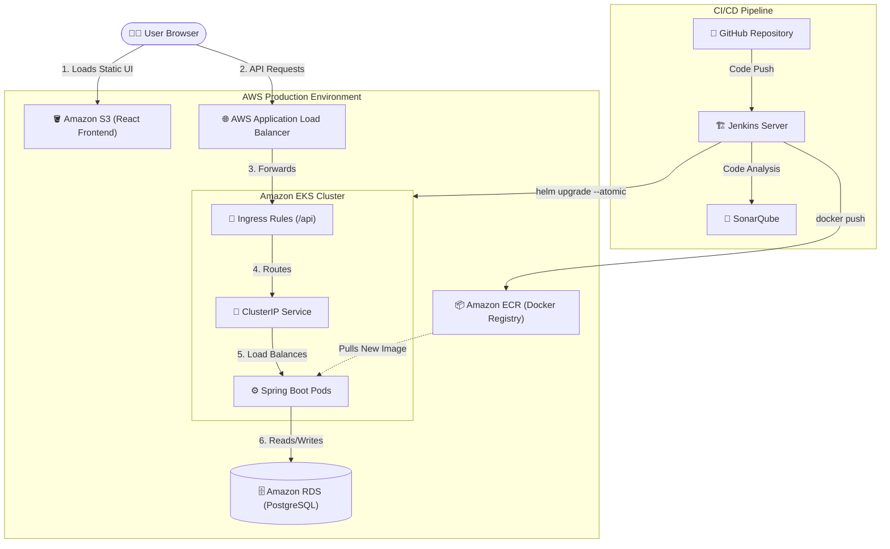

# 🛒 SwiftDeliver: Cloud-Native E-Commerce Platform

A production-grade, self-healing 3-tier e-commerce platform deployed on AWS EKS with decoupled frontend hosting.

## 🏗️ Application Architecture

```text
Internet (Users)
    │
    ├──► [ AWS S3 Bucket ] (Static React Frontend)
    │
    ▼
AWS ALB (Application Load Balancer)
    │
    └── /api/* ──► Ingress Rules (AWS Load Balancer Controller)
                        │
                        └──► swiftdeliver-backend (ClusterIP : 80)
                                │
                                └──► Spring Boot Pods (Port 8080)
                                        │
                                        └──► Amazon RDS (PostgreSQL : 5432)

```



## 🧩 Application Overview

SwiftDeliver (formerly Instamart) is a decoupled 3-tier application built for high availability and zero-downtime deployments.

| Component | Language/Tech | Port | Description |
| --- | --- | --- | --- |
| **Frontend** | React + Vite | 80 / 443 | Decoupled customer-facing UI hosted on S3 |
| **Backend API** | Java (Spring Boot) | 8080 | RESTful API managing products, orders, and routing |
| **Database** | PostgreSQL (AWS RDS) | 5432 | Highly available relational database in private subnets |

## 🛠️ Tech Stack

**Application**

* **Backend:** Java 17, Spring Boot, Spring Data JPA, Maven
* **Frontend:** React, Vite, Axios
* **Database:** Amazon RDS (PostgreSQL 16)

**DevOps & Cloud**

* **Containerization:** Docker
* **Orchestration:** Kubernetes (AWS EKS) & Helm
* **CI/CD:** Jenkins (Automated declarative pipelines)
* **Quality & Security:** SonarQube, Trivy
* **IaC:** Terraform (VPC, EKS, Node Groups, IRSA)
* **AWS Services:** ECR, ALB, S3, RDS, SSM Parameter Store, IAM

## 📁 Repository Structure

```text
swiftdeliver/
├── swiftdeliver-backend/   # Spring Boot microservice & Dockerfile
├── swiftdeliver-frontend/  # React + Vite frontend source code
├── k8s/                    
│   └── swiftdeliver-helm/  # Helm Chart for Kubernetes deployment
│       ├── Chart.yaml
│       ├── values.yaml
│       └── templates/
│           ├── deployment.yaml
│           ├── service.yaml
│           └── ingress.yaml
├── infra/                  # Terraform modules for AWS provisioning
│   ├── vpc/
│   ├── eks/
│   └── iam/
├── Jenkinsfile             # Declarative CI/CD pipeline definition
└── README.md

```

## ☸️ Kubernetes & Helm Setup

**Pre-requisites:**

* EKS cluster provisioned via Terraform
* AWS Load Balancer Controller installed
* OIDC Provider associated with the cluster
* Helm v3 installed locally

**Deployment Commands:**

```bash
# Update Kubeconfig
aws eks update-kubeconfig --region us-east-1 --name swiftdeliver-prod-cluster

# Deploy the backend using Helm
helm upgrade --install swiftdeliver-backend ./k8s/swiftdeliver-helm \
  --namespace default \
  --set image.tag=latest

```

## 🔁 CI/CD Pipeline (Jenkins)

A fully automated, self-healing pipeline that guarantees production safety.

**Stages:**

1. **Checkout Code:** Pulls the latest commit from the `main` branch.
2. **Build & Unit Test:** Executes `mvn clean package`.
3. **Static Code Analysis:** Pushes code to SonarQube for quality gating.
4. **Secure Credential Fetch:** Authenticates via IAM Instance Profile to fetch database credentials directly from AWS SSM Parameter Store at runtime.
5. **Containerize & Push:** Builds the Docker image, tags it dynamically with the Jenkins `$BUILD_NUMBER`, and pushes it to Amazon ECR.
6. **Helm Deployment (Safe Rollout):** Executes `helm upgrade` against the EKS cluster using `--wait` and `--atomic` flags. If the new pods fail the Kubernetes `readinessProbe`, Helm automatically terminates the deployment and rolls back to the previous stable version with zero downtime.

## 🔐 Security Highlights

* **IRSA (IAM Roles for Service Accounts):** The AWS Load Balancer Controller utilizes scoped, pod-level IAM credentials to provision ALBs without exposing node-level IAM permissions.
* **Secret Management (AWS SSM):** No hardcoded passwords in repositories or environment variables. Jenkins fetches database credentials securely from SSM during pipeline execution.
* **Decoupled Blast Radius:** The React frontend is entirely decoupled onto S3, preventing frontend traffic spikes from overwhelming Kubernetes compute nodes.
* **Private Database:** Amazon RDS is isolated in private subnets and only accepts traffic from the EKS worker node Security Groups.

## 🌐 Networking & Routing

| Component | Type | Purpose |
| --- | --- | --- |
| **AWS S3** | Static Hosting | Serves HTML/JS/CSS globally to the user's browser. |
| **AWS ALB** | Internet-facing | Single entry point for API traffic. Handles TLS termination. |
| **Ingress** | Kubernetes Ingress | Routes traffic from ALB to the correct backend Service. |
| **Backend** | ClusterIP | Internal load balancing across Spring Boot replica pods. |

## 📌 Key Engineering Decisions

* **Helm over static YAML:** Transitioned to Helm to parameterize image tags and environmental variables, enabling automated Jenkins deployments and seamless rollbacks.
* **S3 Frontend Hosting:** Hosting the React frontend on S3 rather than inside EKS heavily optimizes cloud costs and reduces compute overhead.
* **ALB Ingress Controller:** Replaced standard Kubernetes `LoadBalancer` services with an Ingress Controller, consolidating all API routing through a single Application Load Balancer to minimize AWS infrastructure costs.
* **Self-Healing CI/CD:** Implemented Helm `--atomic` rollbacks paired with HTTP `readinessProbes` to ensure Jenkins never leaves the cluster in a broken state after a failed code push.

## 👨‍💻 Author

**Nikitha** — Cloud & DevOps Engineer
*Building resilient, automated, and secure infrastructure on AWS & Kubernetes.*
